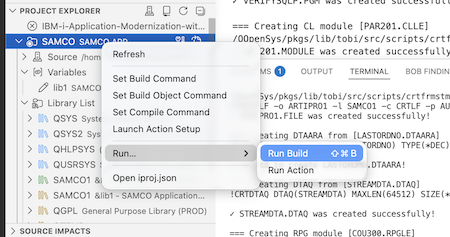

# Lab 102: Convert Fixed-Format RPG to Free

## Overview
Use the **Fixed to Free Conversion Workflow** and the `convert_rpg_source` tool to modernize legacy RPG. The workflow converts each specification group (H, F, D, C) in order and compiles the result to `SAMCOn`.

> **Important Note:** While there are numerous tools for converting RPG Fixed to Free format that enable mass conversion, the goal of this exercise is to demonstrate the use of an agentic workflow that converts the code, proposes corrections and improvements, and ensures the new program compiles successfully.

**Duration**: 20 minutes
**Difficulty**: Intermediate
**Mode**: ℹ️ IBM i Developer
**Source**: Local workspace (`SAMCO/QRPGLESRC/`)
**Build target**: `SAMCOn`

> **Local workspace**: Source lives exclusively in your **local Git clone** (`SAMCO/` directory). Bob reads and edits local files with `read_stream_file` / `write_stream_file`. `SAMCOn` contains compiled objects only — no source members. `SAMSRC` is never used for code modifications.

---

## Prerequisites
- Bob IDE with **IBM Bob Premium Package for i** installed
- **Code for IBM i** extension connected to your IBM i system
- `SAMCOn` in your library list (`n` = your team number)
- [Lab 101](lab101-premium-discover-samco.md) completed (business rules context)

## Step 0: Open your project and build the app (3 minutes)

- Download or git clone the repository
- Open the resulting folder with Bob IDE (File>Open Folder from File)
- Select `IBM-i-Application-Modernization-with-Bob.code-workspace`
- Reconnect to your IBM i 
- Check that your SAMCO app is configured in the `Project Explorer` with your Library List including SAMCOn, Variable `lib1`set to your target build lib (SAMCOn) 
- Right click, Run, Run Build. This should create or replace existing programs, tables. 
> Note that if this is a second time you build, you may have errors when trying to create objects like `LASTORDNO.DTAARA` or `SGSMSGF.MSGF`. This is not a problem because they already exist. Your tables may also need to be (re) populated with the provided SQL script.

You can check the build by browsing the SAMCOn library from vscode (project explorer or object browser views) or simply using a green screen , and two commands: `addlible SAMCOn` then `GO SAMMNU`.  

The initial SAMCO application is succesfully built in SAMCOn ! Let's modernize it with Bob, now. 

---

## Step 1: Launch the Fixed to Free Conversion Workflow (3 minutes)

1. Open the **Bob Workflows** panel in Bob IDE
2. Click on the `Start Workflow` button top right of the Bob Panel
3. Select `Run Workflow in SAMCO`as we're going to run the workflow using the local workspace here. 
2. Select **"Fixed to Free Conversion"** → **Start Workflow**
3. Choose `Fixed to Free Format (SAMCO)`
4. In the scope form, enter (Browse button):
   - **RPG Source File**: `SAMCO/QRPGLESRC/ART200-Work_with_article.PGM.SQLRPGLE`
   - **Output File Path**: `SAMCO/QRPGLESRC/ART200f.PGM.SQLRPGLE`

  > **Important — keep the `.PGM.SQLRPGLE` double extension.** Bob's `get_compile_actions` uses the file extension to pick the right compile command. `.PGM.SQLRPGLE` → `CRTSQLRPGI` (correct for embedded SQL). A plain `.rpgle` output will silently get `CRTBNDRPG` instead, which cannot handle `EXEC SQL`.

   - Ask the as-is program to be compiled. The agentic workflow will solve any issues with the compilation. Same for the to-be free format (missing or incorrect include directory INCDIR in the compilation commands configured for this projet, bad file extension `.rpgle` instead of `.sqlrpgle` that trigger the wrong compilation command etc.)

**What to observe:**
- The workflow reads the local file and identifies spec groups (H, F, D, C)
- Auto-loads `rpg-fixed-to-free` , `rpg-primer-basics`, `rpg-free-format-fundamentals` skills
- Shows a conversion plan table:

| Specification | Converts to |
|--------------|-------------|
| H-spec | `Ctl-Opt` |
| F-spec | `Dcl-F` |
| D-spec | `Dcl-S`, `Dcl-Ds`, `Dcl-C` |
| C-spec | Free-form operations |

- Bob uses `get_compile_actions` and finds **"Create SQLRPGLE Program"** — the `CRTSQLRPGI` action
- The action already carries `CVTCCSID(*JOB)` (handles UTF-8 IFS source), `COMPILEOPT('TGTCCSID(*JOB) INCDIR(...)')` (resolves `/copy familly` and other `/copy` directives from `QPROTOSRC/`), and `RPGPPOPT(*LVL2)` (full free-format pre-processing)
- Bob uses `execute_compile_action` targeting `SAMCOn`

> **Warning** `INCDIR` is passed inside `COMPILEOPT` so the RPG compiler underneath `CRTSQLRPGI` can resolve bare `/copy familly` → `QPROTOSRC/FAMILLY.RPGLEINC`. Previously the missing `INCDIR` was the root cause of the *"copy file not found"* error.

---

## ✅ Success Criteria

- [ ] `convert_rpg_source` pre-converted the ART200 source
- [ ] Fixed to Free Workflow ran through all spec groups
- [ ] Converted program compiled without errors in `SAMCOn`

---

## Key Takeaways

- `convert_rpg_source` wraps IBM i's native `CVTRPGSRC` — faster than manual conversion
- The workflow converts spec groups in order with skill-enforced rules
- `rpg-fixed-to-free` and other specialized skills prevent common pitfalls (ext-described fields, `*INZSR`, indicators)

---

## Next Steps

- Proceed to [Lab 103](lab103-premium-dds-to-sql-workflow.md) — convert DDS files to SQL DDL
- Try converting `CUS200.PGM.SQLRPGLE` or `ORD201.PGM.SQLRPGLE` from the local workspace
